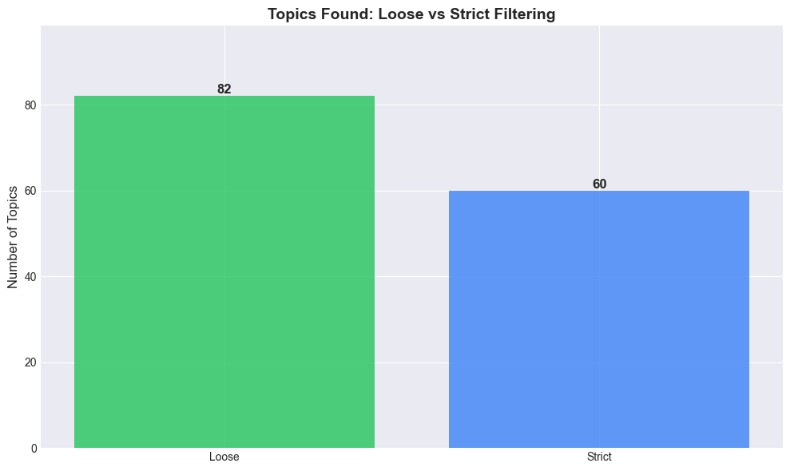

# ClusterBuster - Website Text Clustering Dashboard

A comprehensive web application for automatic topic clustering, analysis, and visualization of text data from CSV/XLSX files. The system uses BERTopic for clustering, LLM analysis for topic coherence assessment, and generates interactive visualizations comparing loose vs strict filtering modes.

## 🚀 Quick Start

### Prerequisites

- Python 3.8 or higher
- pip package manager

### Installation

1. **Clone or navigate to the project directory:**
   ```bash
   cd ClusterBuster
   ```

2. **Install dependencies:**
   ```bash
   pip install -r requirements.txt
   ```

3. **Install spaCy English model (optional, for Named Entity Recognition):**
   ```bash
   python -m spacy download en_core_web_sm
   ```

4. **Set up OpenAI API key (optional, for LLM analysis):**
   ```bash
   export OPENAI_API_KEY=your_api_key_here
   ```
   Or create a `.env` file:
   ```
   OPENAI_API_KEY=your_api_key_here
   ```

### Running the Application

1. **Start the Flask server:**
   ```bash
   python app.py
   ```

2. **Open your browser:**
   Navigate to `http://localhost:5000`

3. **Upload your data:**
   - Click "Choose File" and select a CSV or XLSX file
   - Click "Analyze" to start the pipeline
   - Wait for the analysis to complete (this may take several minutes)

## 📊 Website Components

### 1. **Upload Section**
Located at the top of the page, this section allows you to:
- Upload CSV or XLSX files (up to 200MB)
- View the selected filename
- Start the analysis with the "Analyze" button
- Download PDF reports (placeholder - not yet implemented)

**What it does:** Accepts your data file and sends it to the backend for processing.

### 2. **Main Chart Section**
The large central visualization area that displays:
- **Primary Chart:** "Topics Found: Loose vs Strict" - A bar chart comparing the number of topics discovered in loose vs strict filtering modes
- **Progress Bar:** Shows real-time progress during analysis (Uploading → Preprocessing → Clustering → Visualizing)

**What it shows:** The main comparison between loose and strict filtering approaches, helping you understand how filtering affects topic discovery.


*Example: Topics found in loose vs strict filtering modes*

### 3. **All Topic Visualizations**
A grid of additional charts showing:
- **Coherence Scores Comparison:** Box plots comparing 6 different coherence metrics (overall, semantic, topical focus, lexical cohesion, informativeness, outlier presence) between loose and strict modes
- **Topic Size Distribution:** Histograms showing how documents are distributed across topics in each mode
- **Topic Size vs Coherence:** Scatter plot showing the relationship between topic size and coherence scores

**What it shows:** Detailed analysis of topic quality and distribution patterns, helping you understand which filtering mode produces better clusters.


*Example: Coherence scores comparison across different metrics*


*Example: Distribution of document counts per topic*


*Example: Coherence score distribution patterns*

### 4. **Dataset Summary**
A collapsible panel showing:
- **Number of Documents:** Total documents analyzed
- **Average Length:** Average character count per document
- **Median Length:** Median character count per document

**What it shows:** Basic statistics about your dataset to help you understand the data volume and text length distribution.

### 5. **Overall Sentiment**
A collapsible panel displaying sentiment analysis results:
- **Overall Polarity:** Average sentiment score (-1 to 1, where negative = negative sentiment, positive = positive sentiment)
- **Overall Subjectivity:** How subjective vs objective the text is (0 to 1)
- **Sentiment Distribution:** Counts of positive, negative, and neutral documents

**What it shows:** The overall emotional tone and subjectivity of your documents, helping you understand the general sentiment in your dataset.

### 6. **Named Entities**
A collapsible panel showing extracted entities:
- **Total Entities:** Number of named entities found
- **Entity Types:** Breakdown by type (PERSON, ORG, GPE, DATE, MONEY, etc.)
- **Top Entities:** Most frequently mentioned entities with their counts

**What it shows:** Key people, organizations, locations, dates, and other important entities mentioned in your documents. Helps identify important actors and concepts.

### 7. **Topic Cards**
Individual cards for each discovered topic showing:
- **Topic Label:** A descriptive name for the topic (generated by LLM)
- **Summary:** A 2-3 sentence explanation of what the topic is about

**What it shows:** Human-readable descriptions of each topic cluster, making it easy to understand what themes exist in your data.

### 8. **Dark Mode Toggle**
A toggle switch in the header to switch between light and dark themes. Your preference is saved in browser localStorage.

## 🔄 Pipeline Overview

The analysis pipeline runs automatically when you upload a file. It consists of three main stages, executed in both **LOOSE** and **STRICT** filtering modes:

### Stage 1: Preprocessing
**Purpose:** Clean and filter the raw data

**What it does:**
- Filters by Label and Country columns (if present in your data)
- Removes HTML tags and boilerplate text
- Applies lexical quality checks:
  - **LOOSE mode:** More lenient thresholds, retains more data
  - **STRICT mode:** Stricter thresholds, higher quality but less data
- Calculates text quality metrics (TTR, entropy, MTLD, etc.)

**Output:** Cleaned Excel files saved to `data/` directory with `_loose` or `_strict` suffix

### Stage 2: BERTopic Clustering
**Purpose:** Discover topics in the text data

**What it does:**
- Generates semantic embeddings using sentence transformers
- Applies BERTopic clustering algorithm
- Identifies distinct topics and assigns documents to topics
- Extracts representative documents and keywords for each topic

**Output:** Clustered Excel files with topic assignments, saved to `data/` directory

### Stage 3: LLM Analysis
**Purpose:** Assess topic quality and generate human-readable summaries

**What it does:**
- Analyzes each topic cluster using GPT-4o-mini
- Generates topic labels and summaries
- Calculates coherence scores:
  - **Overall Coherence:** General cluster quality (0-1)
  - **Semantic Coherence:** How related the concepts are
  - **Topical Focus:** How focused on a single topic
  - **Lexical Cohesion:** Shared vocabulary across texts
  - **Lexical Informativeness:** Use of meaningful vs generic terms
  - **Outlier Presence:** How free from outliers

**Output:** Analyzed Excel files with LLM-generated labels and coherence scores

**Note:** LLM analysis requires an OpenAI API key. If not provided, clustering still works but without topic labels and coherence scores.

## 📁 Output Files

All generated files are saved to the `data/` directory with unique timestamps to prevent overwriting:

**Format:** `{filename}_{timestamp}_{stage}_{mode}.xlsx`

**Example files:**
- `myfile_20251126_143000_cleaned_data_loose.xlsx`
- `myfile_20251126_143000_cleaned_data_strict.xlsx`
- `myfile_20251126_143000_clustered_data_loose.xlsx`
- `myfile_20251126_143000_clustered_data_strict.xlsx`
- `myfile_20251126_143000_analyzed_data_loose.xlsx`
- `myfile_20251126_143000_analyzed_data_strict.xlsx`

You can review these files after the analysis completes to see the detailed results.

## 🎯 Understanding Loose vs Strict Modes

The pipeline runs in two modes to help you understand the trade-offs:

### LOOSE Mode
- **More lenient filtering:** Retains more documents
- **More topics:** May discover more granular topics
- **Lower quality threshold:** Includes documents with lower lexical quality
- **Use case:** When you want to capture all possible topics, even if some are lower quality

### STRICT Mode
- **Stricter filtering:** Only keeps high-quality documents
- **Fewer topics:** More focused, higher-quality clusters
- **Higher quality threshold:** Only documents with good lexical properties
- **Use case:** When you want only the most coherent, high-quality topics

The visualizations help you compare these approaches and choose which works better for your use case.

## 🔧 Configuration

### File Format Requirements
- **Supported formats:** CSV, XLSX
- **Maximum file size:** 200MB
- **Required column:** A text column (automatically detected: `content_text`, `text`, `content`, etc.)
- **Optional columns:** `Label`, `Country` (for filtering)

### Column Detection
The system automatically detects:
- **Text column:** `content_text`, `text`, `content`, `Text`, `Content`
- **Label column:** `Label`, `label`, `category`, `Category`
- **Country column:** `Country`, `country`, `location`, `Location`

### Pipeline Parameters
Default parameters can be adjusted in `app.py`:
- `bertopic_min_topic_size`: Minimum documents per topic (default: 5)
- `MAX_CONTENT_LENGTH`: Maximum file size in bytes (default: 200MB)

## 🐛 Troubleshooting

### Analysis takes too long
- Large files may take 10-30 minutes depending on size
- LLM analysis adds significant time (requires API key)
- Consider using smaller sample files for testing

### No topics found
- Try reducing `min_topic_size` parameter
- Check that your text column has sufficient content
- Verify that preprocessing didn't filter out all documents

### LLM analysis not working
- Check that `OPENAI_API_KEY` environment variable is set
- Verify your API key is valid and has credits
- The pipeline will continue without LLM analysis if the key is missing

### Files not saving
- Ensure `data/` directory exists and is writable
- Check disk space availability
- Verify file permissions

## 📝 Notes

- The pipeline processes data in both modes automatically - you don't need to run it separately
- All intermediate files are saved for review
- Dark mode preference is saved in your browser
- Progress is shown in real-time during analysis
- Large datasets may require significant processing time

## 🛠️ Technology Stack

- **Backend:** Flask 
- **Clustering:** BERTopic
- **Embeddings:** Sentence Transformers
- **LLM Analysis:** OpenAI GPT-4o-mini
- **Visualization:** Matplotlib, Seaborn
- **Frontend:** Vanilla JavaScript, Tailwind CSS
- **NLP:** spaCy (NER), TextBlob (Sentiment)

## 📄 License

See LICENSE file for details.
